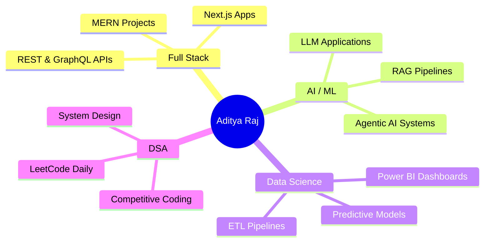

<div align="center">

<!-- ═══════════════════════════════════════════════════════════════ -->
<!--                     HEADER BANNER                              -->
<!-- ═══════════════════════════════════════════════════════════════ -->


<!-- TYPING ANIMATION -->


<!-- STATUS BADGES ROW -->
<br/>


<br/><br/>

</div>

---

<!-- ═══════════════════════════════════════════════════════════════ -->
<!--                      ABOUT ME                                  -->
<!-- ═══════════════════════════════════════════════════════════════ -->

<table align="center" width="100%">
<tr>
<td width="55%" valign="top">

## 🧑‍💻 `whoami`

```yaml
Name        : Aditya Raj
Alias       : @adityaraj1001
Location    : Punjab, India 🇮🇳
University  : Lovely Professional University
Degree      : B.Tech CSE (Computer Science & Engineering)

Roles:
  - Full Stack Developer (MERN)
  - AI / ML Engineer
  - Data Analytics Builder
  - Open Source Contributor

Currently:
  - 🔭 Building real-world AI-powered products
  - 🌱 Deepening expertise in LLMs & MLOps
  - 💡 Exploring Agentic AI systems
  - 📦 Shipping projects that actually matter

Fun Facts:
  - ☕ Fueled by chai & deadlines
  - 🎯 100+ DSA problems conquered
  - 🌙 Best commits happen after midnight
  - 🧩 Bugs are just unsolved puzzles
```

</td>
<td width="45%" align="center" valign="top">


<br/><br/>

[](https://adityaraj1001.github.io)
[](https://adityaraj1001.github.io)
[](mailto:Aditya1rajaditya@gmail.com)

</td>
</tr>
</table>

---

<!-- ═══════════════════════════════════════════════════════════════ -->
<!--                    TECH STACK                                  -->
<!-- ═══════════════════════════════════════════════════════════════ -->

<div align="center">

## ⚙️ Tech Arsenal

### 🧠 Languages


### 🌐 Frontend


### 🔧 Backend


### 🤖 AI / ML / Data


### 🗄️ Databases


### ☁️ DevOps & Tools


</div>

---

<!-- ═══════════════════════════════════════════════════════════════ -->
<!--                   FEATURED PROJECTS                            -->
<!-- ═══════════════════════════════════════════════════════════════ -->

## 🚀 Featured Projects

<div align="center">

| 🏷️ Project | 🔍 Description | 🛠️ Stack | 🌐 Live |
|:---|:---|:---|:---:|
| 🌾 **AgriChat** | AI-powered farming assistant chatbot with RAG pipeline, real-time crop advisory, and multilingual support | `Python` `LangChain` `React` `Vercel` | [🚀 Live](https://agrichat.vercel.app) |
| 🔐 **UPI Risk Intelligence** | End-to-end fraud detection system with 95%+ accuracy using ensemble ML models & real-time anomaly scoring | `Python` `Scikit-learn` `XGBoost` `FastAPI` | [📂 Repo](https://github.com/adityaraj1001) |
| 🚂 **Railway Delay Dashboard** | Interactive Power BI dashboard analyzing 50K+ train records with delay prediction models & trend analysis | `Power BI` `Python` `DAX` `SQL` | [📊 View](https://github.com/adityaraj1001) |
| 🗳️ **VoteXpress** | Secure blockchain-inspired online voting platform with OTP auth, admin panel & live result visualization | `MERN Stack` `JWT` `Socket.io` `Tailwind` | [🚀 Live](https://github.com/adityaraj1001) |
| ⚡ **EV Analytics Dashboard** | Comprehensive Excel-based EV market analysis with pivot charts, KPIs, and automated reporting macros | `Excel` `VBA` `Power Query` `Data Viz` | [📊 View](https://github.com/adityaraj1001) |

</div>

---

<!-- ═══════════════════════════════════════════════════════════════ -->
<!--                    SKILL METERS                                -->
<!-- ═══════════════════════════════════════════════════════════════ -->

## 📊 Skill Proficiency

```text
Full Stack Development  ████████████████████░░░░  82%
Machine Learning / AI   ███████████████████░░░░░░  78%
Data Analytics          ████████████████████░░░░░  80%
DSA / Problem Solving   ██████████████████░░░░░░░  74%
Cloud & DevOps          ███████████████░░░░░░░░░░  60%
System Design           █████████████░░░░░░░░░░░░  54%
```

---

<!-- ═══════════════════════════════════════════════════════════════ -->
<!--                    GITHUB STATS                                -->
<!-- ═══════════════════════════════════════════════════════════════ -->

<div align="center">

## 📈 GitHub Statistics


&nbsp;&nbsp;


<br/><br/>


</div>

---

<!-- ═══════════════════════════════════════════════════════════════ -->
<!--                  CONTRIBUTION GRAPH                            -->
<!-- ═══════════════════════════════════════════════════════════════ -->

<div align="center">

## 🗓️ Contribution Activity


</div>

---

<!-- ═══════════════════════════════════════════════════════════════ -->
<!--                  CONTRIBUTION SNAKE                            -->
<!-- ═══════════════════════════════════════════════════════════════ -->

<div align="center">

## 🐍 Watch My Contributions Get Eaten

<picture>
  <source media="(prefers-color-scheme: dark)" srcset="https://raw.githubusercontent.com/adityaraj1001/adityaraj1001/output/github-contribution-grid-snake-dark.svg"/>
  <source media="(prefers-color-scheme: light)" srcset="https://raw.githubusercontent.com/adityaraj1001/adityaraj1001/output/github-contribution-grid-snake.svg"/>
  
</picture>

</div>

---

<!-- ═══════════════════════════════════════════════════════════════ -->
<!--                    LEETCODE STATS                              -->
<!-- ═══════════════════════════════════════════════════════════════ -->

<div align="center">

## 🧠 LeetCode Performance


<br/><br/>


</div>

---

<!-- ═══════════════════════════════════════════════════════════════ -->
<!--               GITHUB PROFILE SUMMARY CARDS                    -->
<!-- ═══════════════════════════════════════════════════════════════ -->

<div align="center">

## 🃏 Profile Summary Cards


&nbsp;

&nbsp;


</div>

---

<!-- ═══════════════════════════════════════════════════════════════ -->
<!--                  ACHIEVEMENTS / TROPHIES                       -->
<!-- ═══════════════════════════════════════════════════════════════ -->

<div align="center">

## 🏆 GitHub Trophies


</div>

---

<!-- ═══════════════════════════════════════════════════════════════ -->
<!--                  ACHIEVEMENTS BADGES                           -->
<!-- ═══════════════════════════════════════════════════════════════ -->

<div align="center">

## 🎖️ Achievements & Certifications


</div>

---

<!-- ═══════════════════════════════════════════════════════════════ -->
<!--                     CURRENT FOCUS                              -->
<!-- ═══════════════════════════════════════════════════════════════ -->

## 🔭 Currently Working On



---

<!-- ═══════════════════════════════════════════════════════════════ -->
<!--                   CONNECT / SOCIALS                            -->
<!-- ═══════════════════════════════════════════════════════════════ -->

<div align="center">

## 🌐 Connect With Me

<a href="https://www.linkedin.com/in/aditya-raj-a73319282/">
  
</a>
&nbsp;
<a href="https://github.com/adityaraj1001">
  
</a>
&nbsp;
<a href="mailto:Aditya1rajaditya@gmail.com">
  
</a>
&nbsp;
<a href="https://leetcode.com/u/Aditya_Raj12305995/">
  
</a>

<br/><br/>

### 💬 Ask me about
`React` • `Node.js` • `Python` • `Machine Learning` • `Data Analytics` • `DSA` • `System Design`

</div>

---

<!-- ═══════════════════════════════════════════════════════════════ -->
<!--               RANDOM DEV QUOTE (auto-refreshes)               -->
<!-- ═══════════════════════════════════════════════════════════════ -->

<div align="center">

## 💭 Dev Quote of the Day


</div>

---

<!-- ═══════════════════════════════════════════════════════════════ -->
<!--                       FOOTER                                   -->
<!-- ═══════════════════════════════════════════════════════════════ -->

<div align="center">


<br/>

*⭐ If you find my work interesting, drop a star on any repo — it genuinely means a lot!*


</div>
