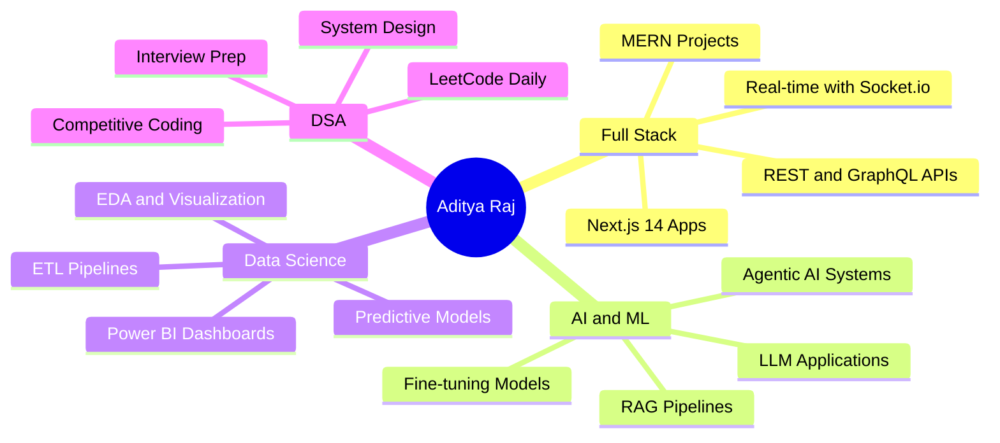

<div align="center">


<br/>

[](https://github.com/adityaraj1001)
[](https://github.com/adityaraj1001?tab=followers)
[](https://github.com/adityaraj1001)
[](mailto:Aditya1rajaditya@gmail.com)

</div>

---

<div align="center">


</div>

<table align="center" width="100%">
<tr>
<td width="55%" valign="top">

## 🧑‍💻 `whoami`

```yaml
Name        : Aditya Raj
Alias       : @adityaraj1001
Location    : Punjab, India 🇮🇳
University  : Lovely Professional University
Degree      : B.Tech — Computer Science

Roles:
  - Full Stack Developer (MERN + Next.js)
  - AI / ML Engineer & Researcher
  - Data Analytics Builder
  - Open Source Contributor

Currently:
  - Building real-world AI-powered products
  - Deepening expertise in LLMs & MLOps
  - Exploring Agentic AI Systems
  - Shipping projects that actually matter

Fun Facts:
  - Fueled by chai ☕ & deadlines ⏰
  - 100+ DSA problems conquered 🏆
  - Best commits happen after midnight 🌙
  - Bugs are just unsolved puzzles 🧩
```

</td>
<td width="45%" align="center" valign="top">

<br/>


<br/><br/>

[](https://adityaraj1001.github.io)
[](https://adityaraj1001.github.io)
[](mailto:Aditya1rajaditya@gmail.com)

</td>
</tr>
</table>

---

<div align="center">

## ⚡ Quick Snapshot

| 🔭 Exploring | 🌱 Learning | 👯 Looking to | 💬 Ask me about |
|:---:|:---:|:---:|:---:|
| Agentic AI Systems | LLMs & MLOps | Collaborate on AI/ML | React & Node.js |
| RAG Pipelines | System Design | Open Source Projects | ML & Data Analytics |
| Next.js 14+ | Cloud & DevOps | Internship Roles | Full Stack Architecture |

</div>

---

<div align="center">

## ⚙️ Tech Arsenal


### 🧠 Languages


### 🌐 Frontend


### 🔧 Backend


### 🤖 AI / ML / Data


### 🗄️ Databases


### ☁️ DevOps & Tools


</div>

---

## 🚀 Featured Projects

<div align="center">

<table>
<tr>
<td width="50%" valign="top">

### 🌾 AgriChat
> AI-powered farming assistant with RAG pipeline, real-time crop advisory & multilingual support

**Stack:** `Python` `LangChain` `React` `Vercel` `OpenAI`

[](https://agrichat.vercel.app)
[](https://github.com/adityaraj1001)

</td>
<td width="50%" valign="top">

### 🔐 UPI Risk Intelligence
> Fraud detection system with **95%+ accuracy** using ensemble ML models & real-time anomaly scoring

**Stack:** `Python` `XGBoost` `Scikit-learn` `FastAPI`

[](https://github.com/adityaraj1001)

</td>
</tr>
<tr>
<td width="50%" valign="top">

### 🗳️ VoteXpress
> Secure online voting platform with OTP auth, admin panel & live result visualization

**Stack:** `MERN` `JWT` `Socket.io` `Tailwind CSS`

[](https://github.com/adityaraj1001)
[](https://github.com/adityaraj1001)

</td>
<td width="50%" valign="top">

### 🚂 Railway Delay Dashboard
> Power BI dashboard analyzing **50K+ train records** with delay prediction & trend analysis

**Stack:** `Power BI` `Python` `DAX` `SQL`

[](https://github.com/adityaraj1001)

</td>
</tr>
<tr>
<td width="50%" valign="top">

### ⚡ EV Analytics Dashboard
> Excel-based EV market analysis with pivot charts, KPIs & automated reporting macros

**Stack:** `Excel` `VBA` `Power Query` `DAX`

[](https://github.com/adityaraj1001)

</td>
<td width="50%" valign="top">

### 🤖 Agentic AI — Coming Soon
> Building something exciting with LangGraph & multi-agent orchestration. Stay tuned!

**Stack:** `LLMs` `LangGraph` `FastAPI` `Next.js`

[](https://github.com/adityaraj1001)

</td>
</tr>
</table>

</div>

---

## 📊 Skill Proficiency

```text
Full Stack Development  ████████████████████░░░░  82%
Machine Learning / AI   ███████████████████░░░░░░  78%
Data Analytics          ████████████████████░░░░░  80%
DSA / Problem Solving   ██████████████████░░░░░░░  74%
Cloud & DevOps          ███████████████░░░░░░░░░░  60%
System Design           █████████████░░░░░░░░░░░░  54%
```

---

<div align="center">

## 📈 GitHub Statistics


&nbsp;&nbsp;


<br/><br/>


</div>

---

<div align="center">

## 🗓️ Contribution Activity


</div>

---

<div align="center">

## 🐍 Watch My Contributions Get Eaten

<picture>
  <source media="(prefers-color-scheme: dark)" srcset="https://raw.githubusercontent.com/adityaraj1001/adityaraj1001/output/github-contribution-grid-snake-dark.svg"/>
  <source media="(prefers-color-scheme: light)" srcset="https://raw.githubusercontent.com/adityaraj1001/adityaraj1001/output/github-contribution-grid-snake.svg"/>
  
</picture>

> ⚠️ Snake animation requires GitHub Action to run once — see setup below

</div>

---

<div align="center">

## 🧠 LeetCode Performance

[](https://leetcode.com/u/Aditya_Raj12305995/)

<br/>

[](https://leetcode.com/u/Aditya_Raj12305995/)


</div>

---

<div align="center">

## 🃏 Profile Summary Cards


<br/>


&nbsp;

&nbsp;

&nbsp;


</div>

---

<div align="center">

## 🏆 GitHub Trophies


</div>

---

## 🔭 Current Focus



---

<div align="center">

## 🎖️ Achievements


</div>

---

<div align="center">

## 💭 Dev Quote of the Day


</div>

---

<div align="center">

## 🌐 Connect With Me

<a href="https://www.linkedin.com/in/aditya-raj-a73319282/">
  
</a>
&nbsp;
<a href="https://github.com/adityaraj1001">
  
</a>
&nbsp;
<a href="mailto:Aditya1rajaditya@gmail.com">
  
</a>
&nbsp;
<a href="https://leetcode.com/u/Aditya_Raj12305995/">
  
</a>

<br/><br/>

### 💬 Ask me about
`React` &nbsp;•&nbsp; `Node.js` &nbsp;•&nbsp; `Python` &nbsp;•&nbsp; `Machine Learning` &nbsp;•&nbsp; `Data Analytics` &nbsp;•&nbsp; `DSA` &nbsp;•&nbsp; `System Design`

<br/>


<br/>

⭐ **If you find my work interesting, drop a star on any repo — it genuinely means a lot!**

<br/>


</div>

---

<details>
<summary>🐍 Snake Animation GitHub Actions Setup (Click to expand)</summary>

Create `.github/workflows/snake.yml` in your repo with:

```yaml
name: Generate Snake
on:
  schedule:
    - cron: "0 0 * * *"
  workflow_dispatch:
jobs:
  generate:
    runs-on: ubuntu-latest
    steps:
      - uses: Platane/snk@v3
        with:
          github_user_name: adityaraj1001
          outputs: |
            dist/github-contribution-grid-snake.svg
            dist/github-contribution-grid-snake-dark.svg?palette=github-dark
      - uses: crazy-max/ghaction-github-pages@v3
        with:
          target_branch: output
          build_dir: dist
        env:
          GITHUB_TOKEN: ${{ secrets.GITHUB_TOKEN }}
```

Then go to **Actions tab → Generate Snake → Run workflow** once.

</details>
