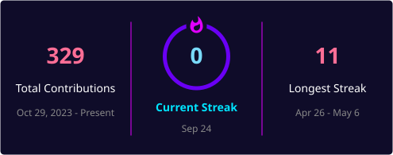

 

  

  

👨‍💻 About Me

<table width="100%">
<tr>
<td width="50%" valign="top">

🎓 Education

B.Tech Computer Science
Lovely Professional University

📍 Based In

Patna, Bihar, India

💻 Roles

Full Stack Developer
AI/ML Engineer
Data Analytics Builder
Open Source Contributor

</td>
<td width="50%" valign="top">

🧠 Currently

Agentic AI
LLMs & RAG
MLOps
System Design

🔥 Practice

Daily DSA
LeetCode
Problem Solving

🤝 Open To

Internships
Freelance
AI/ML Collaboration
Open Source

</td>
</tr>
</table>

🧰 Tech Arsenal

  

<table>
<tr>
<td align="center"><strong>AI / ML</strong> PyTorch · TensorFlow · LangChain · HuggingFace</td>
<td align="center"><strong>DATA</strong> Pandas · SQL · Power BI · DAX</td>
<td align="center"><strong>CLOUD</strong> AWS · Docker · Vercel · Firebase</td>
</tr>
</table>

🎯 Skill Matrix

<table>
<tr>
<td align="center"></td>
<td align="center"></td>
<td align="center"></td>
</tr>
<tr>
<td align="center"></td>
<td align="center"></td>
<td align="center"></td>
</tr>
</table>

🚀 Featured Builds

<table width="100%">
<tr>
<td width="50%" valign="top">

🌾 AgriChat

AI farming assistant with RAG, crop advisory and multilingual support.

Stack: Python LangChain React OpenAI

</td>
<td width="50%" valign="top">

🛡️ UPI Risk Intelligence

Fraud detection engine with ensemble models and real-time anomaly scoring.

Stack: Python XGBoost Scikit-learn FastAPI

</td>
</tr>
<tr>
<td width="50%" valign="top">

🗳️ VoteXpress

Secure online voting platform with OTP authentication, admin controls and live results.

Stack: MERN JWT Socket.io Tailwind

</td>
<td width="50%" valign="top">

🚆 Railway Delay Dashboard

Power BI analytics dashboard with delay prediction and trend analysis.

Stack: Power BI Python DAX SQL

</td>
</tr>
</table>

📊 GitHub Live Analytics

<table width="100%">
<tr>
<td width="50%" align="center" valign="top">

</td>
<td width="50%" align="center" valign="top">

</td>
</tr>
</table>

 

  

🐍 Live Contribution Snake

<picture>
<source media="(prefers-color-scheme: dark)" srcset="https://raw.githubusercontent.com/adityaraj1001/adityaraj1001/output/github-contribution-grid-snake-dark.svg"/>
<source media="(prefers-color-scheme: light)" srcset="https://raw.githubusercontent.com/adityaraj1001/adityaraj1001/output/github-contribution-grid-snake.svg"/>

</picture>

🧠 LeetCode Performance

  

<table>
<tr>
<td align="center"></td>
<td align="center"></td>
<td align="center"></td>
</tr>
<tr>
<td align="center"></td>
<td align="center"></td>
<td align="center"></td>
</tr>
</table>

🏆 GitHub Trophy Case

🗺️ Focus Map

mindmap
  root((ADITYA RAJ))
    Full Stack
      MERN
      Next.js
      REST APIs
      GraphQL
      Socket.io
    AI and ML
      LLMs
      RAG
      Agentic AI
      LangGraph
      Fine Tuning
    Data
      Power BI
      SQL
      ETL
      Visualization
    DSA
      LeetCode
      System Design
      Competitive Coding
      Interview Prep

💡 What I Like Building

💬 Developer Quote

🌐 Connect With Me

  

